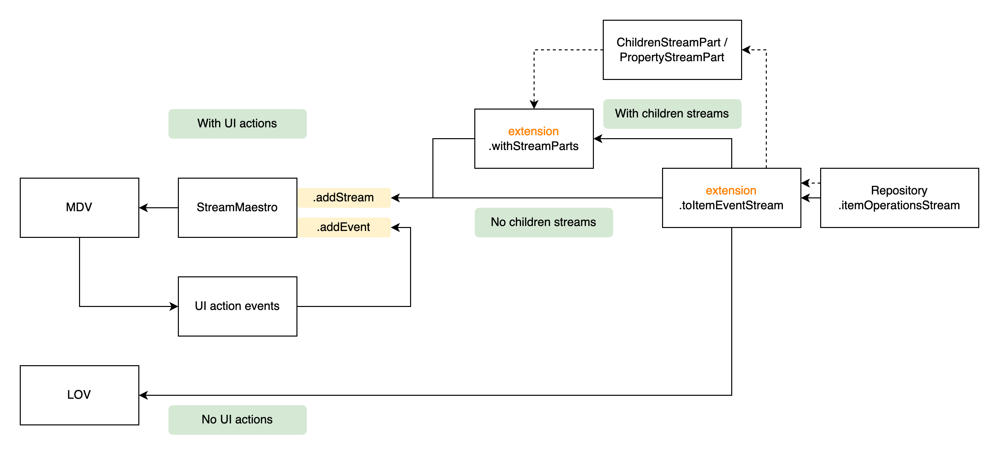

# stream_maestro

A CMiC Flutter package for managing and streaming UI data and action events to UI components like Master Details View (MDV) and List of Values (LOV).

> **Note:** This package includes automated GitHub Actions workflows for tag creation and release management.

## Features

- Unified stream management for data and UI action events
- Seamless integration with CMiC Repository pattern
- Support for Master Details View (MDV) and List of Values (LOV) components
- Built-in status checking for active streams and subscriptions

## Installation

Add to your `pubspec.yaml`:

```yaml
dependencies:
  stream_maestro:
    git:
      url: https://github.com/CMiC-Flutter/stream_maestro
      ref: main
```

Or using [cmic_pacman](https://github.com/CMiC-Flutter/cmic_pacman):

```sh
cmic_pacman add dev:stream_maestro
```

## Quick Start

```dart
import 'package:test_repo_1/stream_maestro.dart';

// Create a StreamMaestro
final streamMaestro = StreamMaestro<Record>();

// Add a data stream from repository
streamMaestro.addStream(
  repo
    .itemOperationsStream<Record, Record>(criteria, match: (_, __) => true)
    .toItemEventStream(),
);

// Use in UI component
MasterDetailsView<Record>(
  dataStream: streamMaestro.stream,
  onDispose: streamMaestro.close,
);
```

See [Getting Started](documentation/getting_started.md) for complete setup instructions.

## Documentation

### Getting Started
| Guide | Description |
|-------|-------------|
| [Getting Started](documentation/getting_started.md) | 5-minute setup guide with complete example |
| [Core Concepts](documentation/core_concepts.md) | Key abstractions and how they work together |

### Guides
| Guide | Description |
|-------|-------------|
| [Architecture](documentation/architecture.md) | Internal design and data flow |
| [Troubleshooting](documentation/troubleshooting.md) | Common issues and solutions |

## Which Guide Should I Read?

| I want to... | Read this |
|--------------|-----------|
| Get started quickly | [Getting Started](documentation/getting_started.md) |
| Understand how it works | [Core Concepts](documentation/core_concepts.md) |
| Attach child streams | [Core Concepts - Stream Parts](documentation/core_concepts.md#stream-parts) |
| Fix an error | [Troubleshooting](documentation/troubleshooting.md) |
| Understand internals | [Architecture](documentation/architecture.md) |

## Features

- Manage UI data and action events (sorting, grouping, filtering)
- Convert repository `ItemOperation` streams to `StreamItemEvent` streams
- Filter streams with proper visibility transition handling
- Attach child or property streams to parent items
- Handle errors and UI events in a unified stream

## Requirements

- Flutter SDK: >=1.17.0
- Dart SDK: ^3.6.2
- Dependencies: `rxdart`, `repository`, `stream_action_events`

## Architecture Diagram



The diagram shows how `StreamMaestro` fits into CMiC Flutter architecture:
- Repository produces `ItemOperation` streams
- Convert to `StreamItemEvent` using `toItemEventStream`
- For simple UI (LOV), consume directly
- For complex UI (MDV), use `StreamMaestro` to manage UI actions

## License

Proprietary - CMiC Flutter Team
